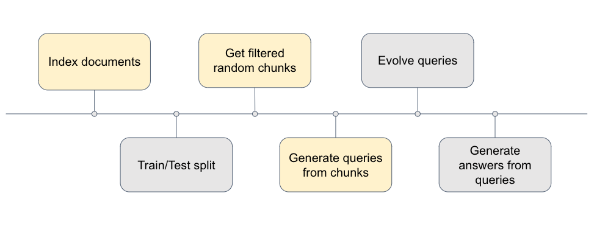
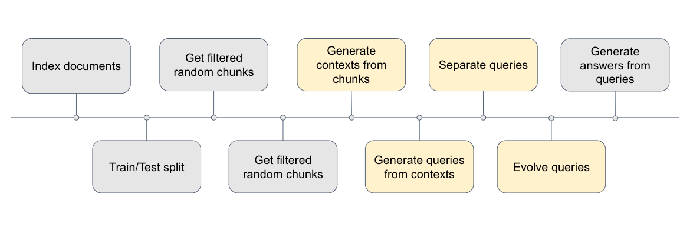

# Context

This code was implemented to generate datasets to use for (1) evaluation of the RAG via LLM-as-a-judge, (2) empirical evaluation of the RAG and (3) training of COLBERT and Linear Adapters. 

During my internship, it was apparent that current datasets being used for the evaluation of question-answering tasks for RAGs were primarily for short-answer questions, which did not match the open-ended answering nature of our use-case. Additionally, with the shortfalls of the [`Synthesiser`](https://docs.confident-ai.com/docs/synthesizer-introduction) Class and [`generate_question_context_pairs`](https://docs.llamaindex.ai/en/stable/examples/evaluation/retrieval/retriever_eval/) from DeepEval and LlamaIndex respectively when it comes to dataset generation, I aimed to fill the gap with this dataset generation method. 

In the present dataset generation classes, we found that they were still lacking because of (1) lack of filtering of bad chunks in the case of LlamaIndex, (2) strong coupling with ChromaDB meaning that you would have to reupload, chunk, index, etc each time you wanted to generate queries in the case of using DeepEval's `Synthesiser` class, (3) poor few-shot prompting by both LlamaIndex and DeepEval that would require decoupling at each stage of the generation, and (4) contexts generated from within `Synthesiser` Class were not cross-document. As such, instead of inheriting from DeepEval's codebase, I decided to **fully generate my own class object to generate synthetic data**. This would allow for more customisability of prompts, as well as integration with one's own VectorStore during implementation, therefore allowing us to deal with our own chunks if we want to.

# Initial Thoughts

We want to take heavy inspiration from DeepEval's synthetic data generation, which can be split into multiple parts:

1. Choosing the right chunks to generate queries from (filters via LLM)
2. Expanding the chunks into contexts (up to 3 concatenated chunks)
3. Generating queries from contexts (by LLM)
4. Evolving queries into more complex queries (by LLM)

Barring the poor few-shot prompting by DeepEval at each stage, the above workflow is good because in theory, it mitigates poor chunks from being used to generate queries. Some issues surfaced out by the poor-few shot prompting was that despite providing multiple chunks, most of the queries generated only referred to one chunk at a time (even though it was possible to ask general questions that covered all chunks within the contexts generated). Maintaining the same thought process of generation based on multiple chunks instead of single chunks, it was made clear that the limitation of LlamaIndex's `generate_question_context_pairs` was that the queries generated only had 1 'gold chunk', which is unlikely the case for more general questions. As such, much of the initial thought process was to mimic DeepEval's generation methods using the existing semantic chunks within Milvus, only focusing on making the few-shot prompts better so as to generate queries from >1 chunk each time.

# Early Functions to Generate Context

1. `get_n_random_chunks` : ensures that chunks are suitable for generation from query
   * Shuffles chunks randomly
   * Preliminary check for length of chunk >200 characters
   * Passes chunk to `evaluate_chunk` function
2. `get_n_contexts` : uses cosine similarity of chunk obtained from `get_n_random_chunks` to obtain as many chunks similar chunks as specified
   * Passes through same checks as `get_n_random_chunks`
   * Ensures that cosine similarity between retrieved similar chunks > threshold similarity (0.5)
3. `evaluate_chunk_template` : evaluates chunk based on self-containment
   * Prompt provided below
4. `evaluate_chunk` : calls LLM using `evaluate_chunk_template` and provides final score
   * Returns string value provided by LLM as evaluation

## Prompt Template:

```
Given a context, complete the following task and return the result as a single integer of 0 or 1. Evaluate the supplied context and assign a numerical score of either 0 (Low) of 1 (High) for each of the following criteria in your response:

- **self_containment**: Evaluate whether the context provides enough information to be understood on its own, without requiring additional external knowledge. A score of 1 indicates the context is complete and self-contained, while a score of 0 reflects the need for further information.

**

Example context: "February 18, 2013. Archived from the original (https://ww w.alcatel-lucent.com/press/2013/002793) on March 13, 2016. Retrieved March 10, 2016."
Example output: "0"

Example context: "For fundamental contributions to and leadership in telecommunications switching systems."
Example output: "0"

Example context: "AES is a variant of Rijndael, with a fixed block size of 128 bits, and a key size of 128, 192, or 256 bits. By contrast, Rijndael per se is specified with block and key sizes that may be any multiple of 32 bits, with a minimum of 128 and a maximum of 256 bits. Most AES calculations are done in a particular finite field. AES operates on a 4x4 column-major order array of 16 bytes b0, b1,..., b15 termed the state. The key size used for an AES cipher specifies the number of transformation rounds that convert the input, called the plaintext, into the final output, called the ciphertext. The number of rounds are as follows: 10 rounds for 128-bit keys."
Example output: "1"

Your output MUST only be a string containing the value 0 or 1. Do not add any additional information to your response.

**

context:
{context}

JSON:
"""
```

## Results of Early Functions:

### Positive Example:

```python
"""
Group (mathematics) Definition): Identity: there exists an element such that, for each element in , it holds that . Inverse: for each element of , there exists an element so that . 
     
Galois in 1832 was the first to use the term "group",[11] signifying a collection of permutations closed under composition.[12] Arthur Cayley's 1854 paper On the theory of groups defined a group as a set with an associative composition operation and the identity 1, today called a monoid.[13] In 1870 Kronecker defined an abstract binary operation that was closed, commutative, associative, and had the left cancellation property ,[14] similar to the modern laws for a finite abelian group.[15] Weber's 1882 definition of a group was a closed binary operation that was associative and had left and right cancellation.[16] Walther von Dyck in 1882 was the first to require inverse elements as part of the definition of a group.
 
For instance, almost all systems studied are sets, to which the theorems of set theory apply. Those sets that have a certain binary operation defined on them form magmas, to which the concepts concerning magmas, as well those concerning sets, apply. We can add additional constraints on the algebraic structure, such as associativity (to form semigroups); identity, and inverses (to form groups); and other more complex structures.
"""
```

### Negative Example 1:

```python
"""
Retrieved 2010-08-10. 35. T. Krovetz, W. Dai (2010). "How to get fast AES calls?" (https://groups.google.com/group/crypto pp-users/msg/a688203c2314ef08). Crypto++ user group. Retrieved 2010-08-11. 36. "Crypto++ 5.6.0 Pentium 4 Benchmarks" (http://www.cryptopp.com/benchmarks-p4.html). Crypto++ Website. 2009. Archived (https://web.archive.org/web/20100919121759/http://cryptop p.com/benchmarks-p4.html) from the original on 19 September 2010. Retrieved 2010-08-10.

[34] A performance analysis using the Crypto++ security library showed an increase in throughput from approximately 28.0 cycles per byte to 3.5 cycles per byte with AES/GCM versus a Pentium 4 with no acceleration.
"""
```

### Negative Example 2:

```python
"""
Member selection .* "sizeof" sizeof "typeid" typeid The object-oriented principle ensures the encapsulation of all and only the functions that access the internal representation of a type. C++ supports this principle via member functions and friend functions, but it does not enforce it. 

operator, nor does it change the number of operands that the operator uses (any operand may however be ignored by the operator, though it will be evaluated prior to execution). Overloaded "&&" and "||" operators lose their short-circuit evaluation property. Polymorphism enables one common interface for many implementations, and for objects to act differently under different circumstances. ')
"""
```

From here, we observe 2 key problems. In terms of the first negative example, it is apparent that the filtering prompt has not filtered out citations, which is not ideal for generating queries. Citations are especially prominent within the chunks we have in our Milvus Vectorstore (made up of Wikipedia articles), hence if we want to continue working with this dataset, something needs to be done to filter these chunks out early.

For the second negative example, while the chunks are self-contained, it is difficult to ask a multi-chunk question when each chunk is so specific within their own use cases. This makes apparent the fact that when dealing with small/unevenly-sized chunks, always generating contexts in order to generate questions may not be the best choice. Instead, it is highly plausible that we can come up with queries that can be answered across multiple chunks using more general, open-ended chunks, as in the `Synthesiser` class when they use token-level chunking.

## Decision Point

From the above observations, I decided to deviate from always generating from contexts. Instead, I came to the conclusion that if the chunks are content-rich enough, it makes sense to use single chunks to generate queries, from which these queries will be used for evaluation of retrieval. On the other hand, I will also prepare a separate database for which we will chunk the text using uniform word-level chunking, thereby ensuring that there is sufficient context within each chunk to generate more generic queries that span across multiple chunks. I will then use this dataset for evaluating chunks, retrieval and RAG again.

# Updated Single-Query Generation v1

1. `get_n_random_chunks` : ensures that chunks are suitable for generation from query
   * Shuffles chunks randomly
   * Preliminary check for length of chunk \>200 characters
   * Passes chunk to `evaluate_chunk` function
2. `evaluate_chunk_template` : evaluates chunk based on self-containment
   * Updated prompt provided below
3. `evaluate_chunk` : calls LLM using `evaluate_chunk_template` and provides final score
   * Returns string value provided by LLM as evaluation
4. `generate_query_chunk_template` :
   * Prompt provided below

## Updated Chunk Evaluation Template

```python
"""
Given a chunk, complete the following task and return the result as a single integer of 0 or 1.
Evaluate the supplied chunk and assign a numerical score of either 0 (Low) of 1 (High) for each of the 
following criteria in your response:

- **self_containment**: Evaluate whether the chunk provides enough information to be understood on its own, 
without requiring additional external knowledge. If the chunk mentions an individual, or an organisation, the identity of either entity must be clear in a self-contained chunk. A score of 1 indicates the chunk is complete and self-contained, while a score of 0 reflects the need for further information.
- **not_metadata**: Evaluate whether the chunk primarily consists of citations, links, dates, or other structural or metadata elements. A score of 0 indicates that the chunk contains primarily metadata, while a score of 1 indicates that the chunk contains primarily content.

**
IMPORTANT: Please make sure to only return in dictionary format, with the 'self_containment' and 'not_metadata' keys. Be strict in your evaluation. It is better to have a lower score (0) than to be lenient in your evaluation.

Example chunk: "Retrieved 2010-08-10. 35. T. Krovetz, W. Dai (2010). "How to get fast AES calls?" (https://groups.google.com/group/crypto pp-users/msg/a688203c2314ef08). Crypto++ user group. Retrieved 2010-08-11. 36. "Crypto++ 5.6.0 Pentium 4 Benchmarks" (http://www.cryptopp.com/benchmarks-p4.html). Crypto++ Website. 2009. Archived (https://web.archive.org/web/20100919121759/http://cryptop p.com/benchmarks-p4.html) from the original on 19 September 2010. Retrieved 2010-08-10."
Example output: {{"self_containment": 1, "not_metadata": 0}}

Example chunk: "I loved music and thought I could be very good, but I knew I would never be John Coltrane or Stan Getz. I was interested in medicine and thought I could be a fine doctor, but I knew I would never be Michael DeBakey."
Example output: {{"self_containment": 0, "not_metadata": 1}}

Example chunk: "38. Attacks that show that the cipher does not perform as advertised (i.e., the level of difficulty involved in breaking it is lower than claimed), which are nevertheless of high enough complexity so that they are not practically achievable. 39. FIPS PUB 46-3 Data Encryption Standard (DES) (http://csrc.nist.gov/publications/fips/fips46-3/f ips46-3.pdf) (This is the third edition, 1999, but includes historical information in the preliminary section 12.) 40. NIST Special Publication 800-57 Recommendation for Key Management Part 1: General (Revised), March, 2007 (http://csrc.nist.gov/publications/nistpubs/800-57/sp800-57-Part1-revis ed2_Mar08-2007.pdf) Archived (https://web.archive.org/web/20140606050814/http://csrc.nist.g ov/publications/nistpubs/800-57/sp800-57-Part1-revised2_Mar08-2007.pdf) June 6, 2014, at the Wayback Machine. 41."
Example output: {{"self_containment": 1, "not_metadata": 0}}

Example chunk: "24. The Register, UK; Dan Goodin; 30 March 2008; Get your German Interior Minister's fingerprint, here. Compared to other solutions, "It's basically like leaving the password to your computer everywhere you go, without you being able to control it anymore", one of the hackers comments. (https://www.theregister.co.uk/2008/03/30/german_interior_minister_fingerprint_app ropriated) Archived (https://web.archive.org/web/20170810131615/https://www.theregister.co.u k/2008/03/30/german_interior_minister_fingerprint_appropriated) 10 August 2017 at the Wayback Machine 25. "Best Practices for Creating a Secure Guest Account" (https://technet.microsoft.com/en-us/libra ry/ff687018.aspx). 31 August 2016."
Example output: {{"self_containment": 1, "not_metadata": 0}}

Example chunk: "[309] The William J. Clinton Presidential Center and Park in Little Rock, Arkansas, was dedicated in 2004.[310] Clinton released a best-selling autobiography, My Life, in 2004.[311] In 2007, he released Giving: How Each of Us Can Change the World, which also became a New York Times Best Seller and garnered positive reviews.[312] In the aftermath of the 2004 Asian tsunami, U.N."
Example output: {{"self_containment": 1, "not_metadata": 1}}

Your output MUST only be a dictionary following the above format. Do not add any additional information to your response.
**

Chunk:
{chunk}

Output:
"""
```

## Query Generation Template

```python
"""
You are a curious student who is great at asking inquisitive questions. Your task is to come up with a question based on the context information provided below. The question should be self-contained and not require any external knowledge to answer, and should not require referring to the context to know the topic of the question. Give only the question, and no extra commentary, formatting, or chattiness.

**

Example context:
"C++ supports function, class, alias, and variable templates. Templates may be parameterized by types, compile-time constants, and other templates. Templates are implemented by instantiation at compile-time."

Example positive query:
"How do templates contribute to programming in C++?"

Example negative query:
"What templates are there?"

Example context:
"In the case of a journal reference, VVVV is the volume number, M indicates the section of the journal where the reference was published (e.g., L for a letters section), PPPP gives the starting page number, and A is the first letter of the last name of the first author. Periods (.)"
    
Example positive query:
"For journal references, what do the different components like volume, section, page number, and author initials represent?"

Example negative query:
"How to reference author initials?"

Example context:
"The invasion is known to have displaced population to the later Attic-Ionic regions, who regarded themselves as descendants of the population displaced by or contending with the Dorians. The Greeks of this period believed there were three major divisions of all Greek people Dorians, Aeolians, and Ionians (including Athenians), each with their own defining and distinctive dialects."

Example positive query:
"Did the Dorians, Aeolians, and Ionians speak different dialects?"

Example negative query:
"What were the three major divisions of Greek people during the period discussed?"
**

Chunk:
{chunk}
"""
```

Another criterion 'not_metadata' has been added to the chunk evaluation template in hopes to remove citations from eligible chunks to generate from. Query generation template also provides few-shot prompting from small sample-size of generated queries.

## Issues with Query Generation

After generating from our Milvus Database, we annotated all 300 generated queries to have a better understanding of the quality of the generated dataset. These are the results:

<table>
<tr>
<th>Distribution</th>
<th>Value</th>
<th rowspan="4">

</th>
<th>Reason for Bad Query-Chunk</th>
<th>Value</th>
</tr>
<tr>
<td>Good Query-Chunk Pairs</td>
<td>200</td>
<td>Chunk is citation</td>
<td>72</td>
</tr>
<tr>
<td>Bad Query-Chunk Pairs</td>
<td>100</td>
<td>Query references context</td>
<td>28</td>
</tr>
<tr>
<td>Percentage of Good Chunks</td>
<td>0.67</td>
<td>

</td>
<td>

</td>
</tr>
</table>

## Examples of Bad Queries:

```python
"""
What were the three major divisions of Greek people during the period discussed?

What inputs do algorithms accepting input blocks and keys yield as output in the context provided?

How were freed slaves treated in comparison to citizens in the society described?
"""
```

## Examples of Bad Chunks:

```python
"""
Jardin, Xeni (18 May 2007). "BoingBoing names a Virgin America plane: Unicorn Chaser" (http s://web.archive.org/web/20110716225636/http://www.boingboing.net/2007/05/18/boingboing_n ames_a_v.html). Boing Boing. Archived from the original (https://www.boingboing.net/2007/05/ 18/boingboing_names_a_v.html) on 16 July 2011. Retrieved 27 March 2012.

Cockle, James (1848). "On Certain Functions Resembling Quaternions and on a New Imaginary in Algebra" (https://www.biodiversitylibrary.org/item/20157#page/449/mode/1up). The London, Edinburgh and Dublin Philosophical Magazine and Journal of Science. 

(1997). "Qataban". In Meyers, Eric M.; Dever, William G.; Meyers, Carol L.; Muhly, James D.; Pardee, Dennis; Sauer, James A.; Finney, Paul Corby; Jorgensen, John S. (eds.). The Oxford Encyclopedia of Archaeology in the Near East. Vol.4. Oxford & New York: Oxford University Press. pp.383384. 
"""
```

While this is a marked improvement from our previous dataset, there is still more to be desired. Specifically, more should be done to filter the chunks that are citations. In order to do so, there were 2 plausible ways: (1) edit the few-shot prompt and (2) generate the queries from truncated PDFs that exclude the citations. We decided to go with option 1 first because it was more time efficient, and if the results were still poor, we would go on to option 2.

# Updated Single-Query Generation v2

Keeping the same workflow, I edited the few-shot prompt as follows:

## Updated Chunk Evaluation Template

```python
"""
Example chunk: "Retrieved 2010-08-10. 35. T. Krovetz, W. Dai (2010). "How to get fast AES calls?" (https://groups.google.com/group/crypto pp-users/msg/a688203c2314ef08). Crypto++ user group. Retrieved 2010-08-11. 36. "Crypto++ 5.6.0 Pentium 4 Benchmarks" (http://www.cryptopp.com/benchmarks-p4.html). Crypto++ Website. 2009. Archived (https://web.archive.org/web/20100919121759/http://cryptop p.com/benchmarks-p4.html) from the original on 19 September 2010. Retrieved 2010-08-10."
Example output: {{"self_containment": 1, "not_metadata": 0}}
Reason: Large number of website urls, numbers and dates suggest that the chunk is primarily metadata.

Example chunk: "I loved music and thought I could be very good, but I knew I would never be John Coltrane or Stan Getz. I was interested in medicine and thought I could be a fine doctor, but I knew I would never be Michael DeBakey."
Example output: {{"self_containment": 0, "not_metadata": 1}}
Reason: Unclear who the individuals mentioned are, hence the chunk is not self-contained.
"""
```

## Updated Query Generation Template

```python
"""
You are a curious student who is great at asking inquisitive questions. Your task is to come up with a question based on the context information provided below. The question should be self-contained and not require any external knowledge to answer, and should not require referring to the context to know the topic of the question. There should be no mention of "as per the context provided" or any similar phrases in the output. Give only the question, and no extra commentary, formatting, or chattiness.

**

Example context:
"C++ supports function, class, alias, and variable templates. Templates may be parameterized by types, compile-time constants, and other templates. Templates are implemented by instantiation at compile-time."

Example positive query (Can be answered by context):
"How do templates contribute to programming in C++?"

Example negative query (Do not know the topic of the question without looking at context):
"What templates are there?"

Example context:
"The invasion is known to have displaced population to the later Attic-Ionic regions, who regarded themselves as descendants of the population displaced by or contending with the Dorians. The Greeks of this period believed there were three major divisions of all Greek people Dorians, Aeolians, and Ionians (including Athenians), each with their own defining and distinctive dialects."

Example positive query (Can be answered by context):
"Did the Dorians, Aeolians, and Ionians speak different dialects?"

Example negative query (References context within question through phrase "during the period discussed", which is not allowed as reader does not have access to context):
"What were the three major divisions of Greek people during the period discussed?"
**

Chunk:
{chunk}
"""
```

For each template, it was adjusted to provide reasons as to why they were poor chunks or why they were positive/negative queries respectively. This resulted in a significant improvement in the dataset:

<table>
<tr>
<th>Distribution</th>
<th>Value</th>
<th rowspan="4">

</th>
<th>Reason for Bad Query-Chunk</th>
<th>Value</th>
</tr>
<tr>
<td>Good Query-Chunk Pairs</td>
<td>282</td>
<td>Chunk is citation</td>
<td>11</td>
</tr>
<tr>
<td>Bad Query-Chunk Pairs</td>
<td>18</td>
<td>Query references context</td>
<td>7</td>
</tr>
<tr>
<td>Percentage of Good Chunks</td>
<td>0.94</td>
<td>

</td>
<td>

</td>
</tr>
</table>

# Overall Single Query-Chunk Pair Generation Pipeline



### Indexing Documents

For our own testing, we indexed 50 pages of wikipedia articles (obtained via web-crawling) within the Milvus database, generating 7900+ chunks via semantic chunking. We do web-crawling to obtain semantically similar documents within the database, thereby allowing more robust testing (if we have semantically dissimilar documents in our database, we make the retrieval task easy). We use wikipedia articles because it is easy to parse with our baseline parser (instead of complicated documents with nested tables and images), since at this point of the project we had yet to integrate advanced parsing techniques into the pipeline.

There are some downsides to this. By using semantic chunking, we introduce chunks of irregular lengths, whereby not all chunks are valuable for query generation. Also, because we are using wikipedia articles, we expect lots of bibliography references within the database, which we filter out via the `evaluate_chunk` method.

**Note**: If you want to evaluate retrieval across different chunking methods via hit rate (or other methods that require a **word-for-word comparison** between **retrieved chunks** and **chunks expected to be retrieved**), then you **MUST** regenerate datasets for each chunking method. However, if you are using LLM-as-a-judge, or any other methods that do not do a word-for-word comparison, it is fine to only generate one dataset.

### Train/Test Split

This is an essential step only if you want to train your Linear Adapter model or COLBERT retriever to prevent data leakage. If not, this step can be skipped.

### Get Filtered Random Chunks

As documented above, we run the `get_n_random_chunks` method, which filters out chunks that are 1) too short, 2) not self-contained and 3) consisting of primarily metadata/bibliographical references. Chunk length is filtered via character size, and is a parameter in the method. If there are other reasons to filter out chunks in future, the few-shot template in `utils.py` can be edited.

### Generate Queries from Chunks

Query generation is done via LLM, with only 1 criteria: self-containment. A negative query would include phrases like "based on the context provided", which is filtered out via few-shot prompting.

### Query Evolution

Query evolution involves making the query more complex/generalised. We identified that our query could appear too complex/specific at times, hence we apply query evolution. This step can be skipped.

### Generate Answers from Queries

We provide the query-chunk pairs to the LLM, instructing it to answer the queries while referencing the chunks. Results are in the form of JSON, but we convert into csv for easy visualisation.

# Multi-Chunk Query Generation Pipeline



For this pipeline, there are 2 new steps: 1) generating contexts from chunks and 2) separating conjoined queries. The rest are similar as the single chunk query generation pipeline documented above.

### Generate Contexts from Chunks

For each context, we specify a minimum number of chunks and maximum number of chunks we want in the context. From each random chunk, we then do a simple top_k dense retrieval (k=10) within the Milvus database to find similar chunks to the current chunk. These similar chunks must pass through the same filtering process of the `evaluate_chunk` method.

As we can expect, there will be a lot of cases whereby we will fail to retrieve 10 full contexts from just 10 chunks obtained from the `get_n_random_chunks` method, since the filtering process is stringent. As such, the `get_n_contexts` method involves getting 5n random chunks, in hopes that from 5n random chunks, we are able to obtain n contexts.

### Separate Queries

Since we require the generated queries to reference all chunks within the context during generation, there are cases whereby the context generated is simply not general enough for a single query to encapsulate each chunk within the context provided. This results in queries like: "How does binary counting work, **and how** does it differ from the decimal counting system?".

While this is a fair query, we want single question queries that are more human-like. As such we separate the query, using "and" + question words (5W1H) to identify these occurrences of poor generation. We then prompt an LLM with the conjoined query and context it was generated from. The LLM's task is to 1) split the query into 2 independent, self-contained queries, and 2) assign which chunks within the context provided are relevant to which query. We are therefore provided with new query-context pairs. If the new context has >2 chunks, we keep it.

# Possible Future Works

More can be done to adjust the few-shot templates, in particular the query evolution ones to make them more human-like. This could be done with an actual database of sample user queries.